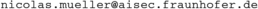

## Audio- und Video-Deepfakes – Erzeugen, Erkennen, Verstehen​

Willkommen! Anbei die Materialien:

### Slides: 
- [Slideset1](slideset1.pdf)
- [Slideset2](slideset2.pdf)
- [Introduction to Gradient Descent](introduction_gradient_descent.pdf)

### Python Notebooks:
- [Deepfake Detection with Python and W2V2](https://www.kaggle.com/code/muellermnicolas/audio-deepfake-detection-with-w2v2-and-mlaad-tiny)
- [Youtube download via Python](https://www.kaggle.com/code/muellermnicolas/yt-dlp-download-video-audio-from-youtube)
- Text to Speech via Python:
  - [Kokoro](https://www.kaggle.com/code/muellermnicolas/kokoro)
  - [Parler TTS](https://www.kaggle.com/code/muellermnicolas/parler-tts-mini)
- [Intro to Python](https://www.kaggle.com/code/colinmorris/hello-python)
- [Intro to Pytorch](https://www.kaggle.com/code/muellermnicolas/pytorch-basics/)

### Commercial and open-source Toos:
- [Resemble.ai](https://www.resemble.ai/)
- [Fraunhofer](https://www.aisec.fraunhofer.de/de/spotlights/Deepfakes.html)
- [Deepfake Total](https://deepfake-total.com/)
- [Spot the Audio Deepfake](https://deepfake-total.com/spot_the_audio_deepfake/)

### Hausarbeit
Sie müssen eine Hausarbeit anfertigen:
- Detail dazu später

### Kontakt
- 
- [Website](https://www.aisec.fraunhofer.de/de/spotlights/Deepfakes.html)
